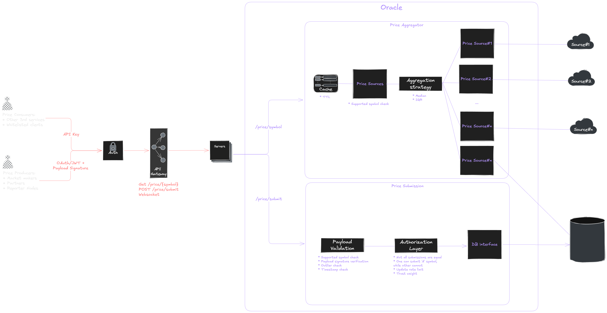

# Band Assignment Software Engineer

* [Problem 1: Boss Baby's Revenge](#problem-1-boss-babys-revenge)
* [Problem 2: Superman's Chicken Rescue](#problem-2-supermans-chicken-rescue)
* [Problem 3: Design oracle system](#problem-3-design-oracle-system)

## Problem Introduction

### Docker

The solution is designed to run inside Docker for simplicity.

To run the solution inside a container, build it as follows:

```bash
cd {repo_root}
docker build -t band-assignment .
```

Once the build is complete, run it using:

```bash
docker run --rm band-assignment
```

## Problem 1: Boss Baby's Revenge
### Description: 
Boss Baby, known for his cool and clever ways, deals with teasing from the neighborhood kids who shoot 
water guns at his house. In response, Boss Baby seeks revenge by shooting **at least one shot back**, but only 
if the kids have already shot at him first. As Boss Baby's assistant, your task is to check if Boss Baby has 
sought revenge for every shot aimed at him at least once and hasn't initiated any shooting himself. 

### Input: 
A string (S, 1 <= len(S) <= 1,000,000) containing characters 'S' and 'R', where 'S' represents a shot and 'R' 
represents revenge. The string represents the sequence of events for one day. 

### Output: 
Return "Good boy" if all shots have been revenged at least once and Boss Baby doesn’t initiate any shots at 
the neighborhood kids first. Return "Bad boy" if these conditions are not satisfied. 
### Note:
Boss Baby doesn’t need to shoot back before the next shots of the kids. He can shoot back whenever 
he wants as long as he doesn’t shoot first. 

| Input    | Output |
| -------- | ------- |
| SRSSRRR  | Good boy    |
| RSSRR | Bad boy     |
| SSSRRRRS    | Bad boy    |
| SRRSSR    | Bad boy|
| SSRSRR    | Good boy    |

### Explanation
In the first example, the first shot “S” has been avenged by the second action. The next two shots “SS” have 
been avenged by the following retaliation shots “RRR”. 

In the second example, the first action is revenge “R”, which makes Boss Baby a bad boy as he shouldn’t 
shoot first. 

In the third example, the first three shots “SSS” are avenged by at least 3 shots “RRRR”. However, the last 
shot has no revenge, hence making Boss Baby a bad boy. 

### Solution#1:

**Algorithm**
1. Validate string's length
2. Check the first character for an early return
3. Iter through each character in the string, checking for `S` and `R`
4. Update the `balance` count accordingly
5. Check the `balance` at the end. If `balance` is zero (`S` and `R` balance themselve out), returns `Good boy`, otherwise `Bad boy`

```cpp
std::string BBR::isGoodBoy_Simple(const std::string &str)
{
    // validate range
    if (str.empty() || str.length() > 1'000'000)
    {
        throw std::runtime_error(ERROR_INVALID_STR_LENGTH);
    }

    if (str.at(0) == 'R')
    {
        return BAD_BOY;
    }

    int balance = 0;
    for (const char c : str)
    {
        if (c == 'S')
        {
            ++balance;
        }
        else if (c == 'R')
        {
            if (balance > 0)
            {
                --balance;
            }
        }
        else
        {
            // disable this for now
            // since it is not stated in the requirement
            // throw std::runtime_error("invalid char");
        }
    }

    return (balance == 0) ? GOOD_BOY : BAD_BOY;
}
```

This solution works, but storing up to a million-characters string in memory might not be ideal in some cases. So, I worked on another solution.

### Solution#2:

This solution is algorithmically the same as the first. However, instead of reading from a string, we read from a text file.

```cpp
std::string BBR::isGoodBoy_ReadFile(const std::string &path)
{
    std::ifstream in(path, std::ios::binary);
    if (!in)
    {
        throw std::runtime_error(ERROR_INVALID_FILE_PATH);
    }

    int balance = 0;
    char c;
    while (in.get(c))
    {
        if (c == 'S')
        {
            ++balance;
        }
        else if (c == 'R')
        {
            if (balance > 0)
            {
                --balance;
            }
        }
        else
        {
            // disable this for now
            // since it is not stated in the requirement
            // throw std::runtime_error("invalid char");
        }
    }

    return (balance == 0) ? GOOD_BOY : BAD_BOY;
}
```

This solution allows for longer seqeuences. However, it introduces additional I/O overhead, which may make it slower than the in-memory version for smaller inputs.

In practice, the in-memory solution is preferred when the input comfortably fits in memory, while the streaming solution is more suitable when input size or memory usage is a concern.

## Problem 2: Superman's Chicken Rescue
### Description: 
In a one-dimensional world, Superman needs to protect chickens from a heavy rainstorm using a roof of limited 
length. Given the positions of chickens and the length of the roof Superman can carry, determine the maximum 
number of chickens Superman can protect. 
### Input: 
The input consists of two integers n and k (1 <= n,k <= 1,000,000), where n represents the number of chickens 
and k denotes the length of the roof Superman can carry. The next line contains n integers (1 <= x <= 
1,000,000,000) representing the positions of the chickens on the one-dimensional axis. 
### Output: 
Output a single integer, denoting the maximum number of chickens Superman can protect with the given roof 
length. 
### Note:
* Superman can position the roof starting at any point on the axis. 
* The roof can cover chickens whose positions are within k units from its starting point. 
* It's not required to cover all chickens, but to maximize the number of chickens protected. 
* It’s guaranteed that the given positions of the chickens will be sorted from lowest to highest.

| Input    | Output |
| -------- | ------- |
| 5 5 <br>2 5 10 12 15   | 2    |
| 6 10 <br>1 11 30 34 35 37 | 4     |

### Explanation:  
In the first example, superman can position the roof starting at position 2 (roof at 2 - 6), covering chickens at 
positions 2 and 5. Thus, he can protect a maximum of 2 chickens. 

In the second example, superman can position the roof starting at position 30 (roof at 30 - 39), covering 
chickens at positions 30, 34, 35, and 37. Thus, he can protect a maximum of 4 chickens.

### Solution#1
**Algorithm**
A sliding window is used to iterate through the array such that:
1. Two pointers:
* `l`: left bound
* `r`: right bound
2. Advance `r` from start to end
3. While `pos[r] - pos[l] >= k`, move `l` forward. (Assuming the array is sorted)
4. Update the maximum window size via `count = max(count, r + l - 1)`

```cpp
int SCR::numMaxChickenCanProtect(const std::string &path)
{
    std::ifstream in(path, std::ios::binary);
    if (!in)
    {
        throw std::runtime_error(ERROR_INVALID_FILE_PATH);
    }

    long long n; // handle 1e09
    int k;
    in >> n;
    in >> k;

    if (n < 1)
    {
        return 0;
    }

    std::vector<long long> pos(n);
    for (long long i = 0; i < n; ++i)
    {
        in >> pos[i];
    }

    int count = 0;
    // iter sliding window
    int l = 0;
    for (int r = 0; r < n; ++r)
    {
        // assume array is always sorted.
        while (pos.at(r) - pos.at(l) >= k)
        {
            ++l;
        }
        count = std::max(count, r - l + 1);
    }

    return count;
}

```

The problem states that the input has lines, so there is only one solution for this as shown above. 

The process is as follows:
1. Read the file and check it. If the file is unreadable, we throw an error.
2. Read the first line for check if `n` and `k` is valid or not.
3. Read the next line to construct an array of positions
4. Iterate through it based on the already-discussed algorithm
5. Return the result.

The problem with this solution is the same as problem#1. There is an additional I/O overhead. Moreover, the vector can be really large in this case, so there might be an exception regarding memory allocation. 


## Problem 3: Design oracle system


### Overview
The oracle system provides aggregated price data and stores incoming price data from trusted clients.

### Features:
* Current price: return the current price of the token based on multi-provider aggregation where the system processes market data from multiple providers and returns reliable price data
* Price Submission: verify and store price data, submitted by trusted clients.

### API Endpoints:
**Get current price**

```
GET /price/{tokenSymbol}
```

**Get historical price**

```
GET /price/submit/?symbol={tokenSymbol}?timestamp={epochUnixTimestamp}?signature={signature}
```

### Architecture Overview



Let's go step-by-step from left to right from the diagram above.

**Clients**

The oracle system serves two types of clients: consumers and producers.

Comsumer is a client that wants to read the price data from the oracle. To prevent unrestricted access, it is required for the client to possess an API-key. API-key is fast and safe enough for read operation since it does not mutate any states. Typically, this type of clients are 3rd party services, internal systems, whitelisted clients, etcs.

Producer is a client that wants to submit price data into the oracle. Since this is a write operation, more securities are required. The producer must be autheticated by either OAuth or JWT. Moreover, the payload needs to be signed for further authorization.

**Auth/API Gateway**

The task for these two component is simple. Filter out invalid requests and route the valid ones to the servers.

**Oracle**

This is the star of the show. There are two parts in the service: price aggregator and price submission.

**Price Aggregator**

The price aggregator retrieves cryptocurrency prices from multiple sources and returns a single reliable price.

```
Controller: Input validation
   ↓
PriceService: Core business logics
   ↓
PriceSource: Handle each provider operations
   ↓
External APIs/ DB
```

From the diagram above, the `Controller` acts as a handler, which is responsible for validating the input from the request. In this case, it just checks whether the given symbol is among those we support.

Next, the payload is forwarded to `PriceService`. It runs the core business logic of this service. This includes getting the current and historical price of the given cryptocurrency. The service runs multiple async tasks and waits for them to complete. Once they are done, the data are processed to eliminate potential outliers to increase the reliability of the return data (more on that later). To reduce the number of requests for the same symbol and timestamp, a simple key-value map cache is used here.

Lastly, `PriceSource` is used to handle all external provider interactions. Each provider has different schema and ways of requesting data. So, we have to individually handle each differently. This execution is simple. It is essentially just a simple fetch call to the endpoint. The price data from our own database will also be queried as one of the sources too.

**Aggregation Strategy**

Since we are working with data from multiple providers, there is always a chance for some of them to be inaccurate. So, we need to find a way to compensate for an error.

To do such a task, the a statistical filtering method, Interquartile Range (IQR), is applied to the queried data.

IQR is a robust way to detect and remove outliers based on the middle 50% of data.

- Q1 (25th percentile): lower quartile
- Q3 (75th percentile): upper quartile
- IQR = Q3 − Q1

Outlier rule:

- Lower bound = Q1 − 1.5 × IQR
- Upper bound = Q3 + 1.5 × IQR

Any data point outside these bounds is considered an outlier.

This method is chosen because of these traits:

- Resistant to extreme values
- Works well for skewed distributions
- Simple and distribution-free

**Caching Strategy**

For now, a simple in-memory cache is used to:

- Enforce 1-minute staleness
- Reduce repeated external API calls
- Improve latency for hot symbols

Cache keys include:

- Symbol
- Timestamp (for historical queries)

**Price Submission**

The price submission path allows authorized producers to submit price data, which are stored and later used during aggregation.

```
Controller: Payload Validation
   ↓
Authorization Layer: Check client authority
   ↓
DB Interface: Write
```

From the diagram above, the `Controller` validate the payload. The validation include:
* Supported symbol check: Only supported token can be written.
* Payload signature verification: check if this exact price is from this producer
* Outlier check: check if the price is not too 'different' from other sources
* Timestamp check: check if the timestamp is possible and not in the future

Next, the authorization layer checks whether this client allows to publish the price data of that particular token. This acts as an additional security to keep the oracle price data truthy.

Lastly, the price data is written into the database for future price aggregation.

